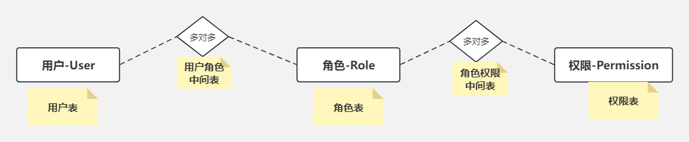
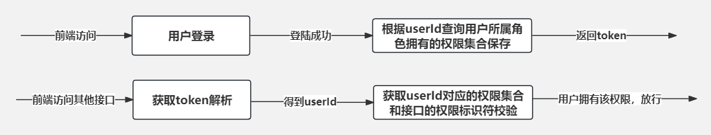

# 手撸RBAC

## 一、概述

### 1、什么是RBAC

- RBAC（Role-Based Access Control）是一种访问控制机制，它基于角色的概念，将权限授予特定的角色，而不是直接授予个体用户。

这种模型允许管理员根据用户的角色来管理他们的权限，从而简化了权限管理和维护。

### 2、为什么要使用RBAC

以下是一个使用RBAC和不使用RBAC的例子：

> 使用RBAC的例子：

假设有一个电子商务网站，有管理员、销售人员和普通用户三种角色。

1. 管理员角色（Admin）：拥有所有权限，可以管理网站的所有功能，包括添加/删除商品、管理用户、查看销售报告等。

2. 销售人员角色（Salesperson）：拥有部分权限，可以添加/编辑商品、查看销售报告，但不能管理用户或修改网站设置。

3. 普通用户角色（User）：拥有最少权限，只能浏览商品、下单购买，不能访问管理后台或其他敏感信息。

管理员将权限分配给不同的角色，例如：

- 管理员角色拥有所有权限。
- 销售人员角色拥有添加/编辑商品、查看销售报告等权限。
- 普通用户角色只能浏览商品、下单购买。

这样，无论网站有多少用户，管理员只需管理角色和权限的关系，而不必为每个用户单独分配权限。

> 没使用RBAC的例子：

在没有RBAC的情况下，管理员需要为每个用户分配具体的权限，例如：

- 用户A：可以添加商品、编辑商品、查看销售报告。
- 用户B：可以编辑商品、查看销售报告，但不能添加商品。
- 用户C：只能浏览商品，不能编辑或添加商品。

管理员需要为每个用户设置不同的权限，这样会导致管理复杂性增加。而且当用户角色发生变化或新增用户时，管理员需要不断地修改权限设置，增加了维护成本。

综上所述，使用RBAC可以简化权限管理，提高安全性和管理效率，而不使用RBAC则会增加管理复杂性和维护成本。

### 3、什么是RBAC

文字太繁琐，直接上图：

## 二、具体实现

- 前端：Layui、Js、Ajax
- 后端：Springboot、Mybatis-Plus、Mysql

